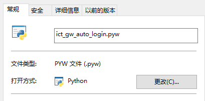
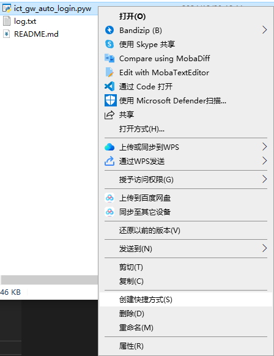
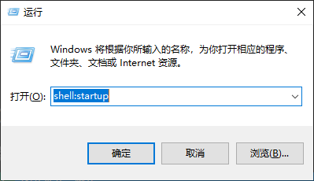

# Windows下进行 https://url_of_gw 长登录

## 一 整体思路：

本项目使用了浏览器的WebDriver功能进行网页加载、自动填充和点击；每 1min 检查一次网络状态，如果发现掉线了就再次登录。

## 二 使用方法：

### 步骤1：安装Selenium自动化工具
#### 1.1 确保系统中安装了python，并 `pip install selenium`

#### 1.2 下载与浏览器版本匹配的 WebDriver，并将其放在系统 PATH 中。

不需要是常用的那个，只需要存在该浏览器即可。我系统中存在Edge浏览器.

具体步骤为：
##### 1.2.1 检查 Microsoft Edge 浏览器版本

打开 Microsoft Edge。
点击右上角的 菜单（三个点） > 帮助和反馈 > 关于 Microsoft Edge。
在页面顶部，你会看到 Edge 的版本号，例如 版本 118.0.2088.76。

##### 1.2.2 下载对应版本的 EdgeDriver
直接搜索 "Edge WebDriver download" 找到官方链接。根据你的 Edge 浏览器版本号，找到匹配的 WebDriver 版本：

- 如果浏览器版本是 118.x.x.x，下载对应的 EdgeDriver。
- 页面上提供了稳定版、Beta、Dev 和 Canary 的不同 WebDriver，通常你需要下载 Stable（稳定版）。
- 点击对应的版本链接下载 WebDriver。

##### 1.2.3 解压并设置环境变量

下载完成后，将文件解压到一个文件夹，例如 C:\WebDriver。添加到系统环境变量：
- 按下 Win + S，搜索 环境变量，选择 编辑系统环境变量。
- 点击 环境变量 > 在“系统变量”下找到 Path，点击 编辑。
- 点击 新建，输入 EdgeDriver 的路径，例如 C:\WebDriver。
- 点击 确定 保存。

##### 1.2.4 验证安装
打开命令提示符（Win + R，输入 cmd）。

输入命令 `msedgedriver`。如果安装正确，应该会看到 EdgeDriver 的版本信息输出。

### 步骤2：向python脚本中添加用户名和密码

把上述用户名和密码修改成自己的

### 步骤3：将该python脚本添加到windows startup

#### 将文件的默认打开程序 修改为你的python路径（或者pythonw路径）

#### 为该文件创建一个快捷方式

#### 将该快捷方式移动到windows 的startup文件夹

## 步骤4：验证效果

- 开机后，注意观察是否有浏览器弹出并进行自动登录；
- 在文件夹中找到`log.txt`，查看内容。
- 可以通过网页断开连接，等待一分钟，看看是否会自动连接。

也可以在你的python环境中执行“python path\to\ ict_gw_auto_login.py”，进行调试。
